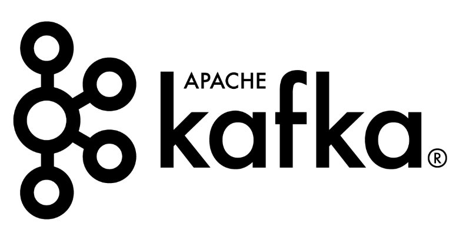

<p align="center">
  <div style="display: flex; justify-content: center; align-items: ;">
    
    
    
  </div>
  <h1 align="center">⚙️Machine Learning and Data Streaming⚙️</h1>
  <p align="center"></p>
</p>

Welcome to the workshop3, Machine learning and Data streaming . This workshop are focuses on processing and managing data obtained by combining a 5 CSV files which have information about happiness score in different countries using the Apache Kafka and Apache Airflow platforms. This project extends the efforts of previous stages where data cleaning (EDA) tasks were performed

## System Requirements 🖥️

### Docker:
- **Operating System:** Compatible with Windows, macOS, and Linux.
- **Processor:** Should be 64-bit.
- **RAM:** At least 4 GB is recommended.
- **Virtualization:** Enable virtualization in the BIOS (such as "Intel VT-x" or "AMD-V").

### Apache Kafka:
- **64-bit Processor.**
- **RAM:** At least 4 GB is recommended.
- **ZooKeeper:** Up to version 2.8.0, Kafka relied on ZooKeeper for coordination. However, starting from version 2.8.0, Kafka supports a mode without ZooKeeper dependency.
- **Docker:** Docker images for Kafka can be used.

**Ensure your device meets these system requirements before running the project to avoid compatibility issues..**

## Project Structure 📃

The structure of the directories and files is as follows:

<pre>
    ├── .gitignore
    ├── README.md
    ├── docker-compose.yml
    ├── requirements.txt
    ├── consumer.py
    ├── dbconfig.py
    ├── feature.py
    ├── producer.py
    ├── docs/
    │   └── Documentation_ws3.pdf
    ├── notebooks/
    │   ├── EDA_001.ipynb
    │   ├── EDA_002.ipynb
    │   ├── EDA_003.ipynb
    │   ├── figures/
    │   │   └── ...
    │   ├── data/
    │   ├── 2015.csv
    │   ├── 2016.csv
    │   ├── 2017.csv
    │   ├── 2018.csv
    │   └── 2019.csv
    ├── model/
    │   └── RandomForestModel.pkl
    ├── public/
    │   ├── airflow_logo.png
    │   ├── kafka_logo.png
    │   └── apache_zookeeper_logo.png
    └──  config/
        └── database.json

</pre>


### Folders 📁
- **data 📊:** Contains .csv files with the data that will be used during the project.
- **notebooks 📚:** Contains the Jupyter notebooks with the project's performance.
- **model 📂:** Contains the model file that has the project's RandomForestModel done in the Jupyter notebooks.
- **docs 📙:** Contains the documentation of the whole project, some of them talk about other evidence, so take a look at them if you are interested.

Key files in the root directory are crucial for the project's execution. Without these, the project will not run correctly.

## Installation Requirements ✔️

The required libraries are listed in the 'requirements.txt' file. Install them using the following command:

pip install -r requirements.txt


## Project Execution 🚀

1. Open a terminal and navigate to the desired folder for cloning the repository:
    ```
    cd your_folder
    ```

2. Clone the repository using this command:
    ```
    git clone https://github.com/VanessaSuare/Workshop3
    ```

3. In the 'config' folder, create a file called 'database.ini' with the following content:
    ```
    [postgresql]
    host=localhost
    database=ws3
    user=your_postgres_user
    password=your_postgres_password

Remember create your 'ws3' database in your posgreSQL!

4. Open a command line and execute the following command to start the Docker service:
    ```
    docker compose up
    ```

5. Open a new terminal, (preferably bash) and execute these commands to access into the folder with kafka producer and execute it:
    ```
    python producer.py
    ```

6. With the producer running, execute the kafka consumer in the same folder using this command:
    ```
    python consumer.py
    ```

## Contact 📧

If you have any questions or need further assistance, feel free to contact me:

- [dayanna.suarez@uao.edu.co](mailto:dayanna.suarez@uao.edu.co)